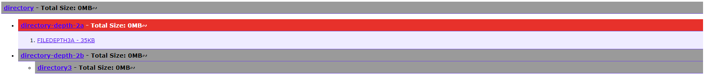

# indexer
A simple tool for generating a HTML index file with links to all sub-directories and their files, something which was requested from a friend who had to produce such a file for a university project with hundreds of directories and thousands of files.

The output looks something like this:

Each directory is open/closeable by clicking on it, which will hold the files that exist within it but not the other directories providing a clean and quick view.
